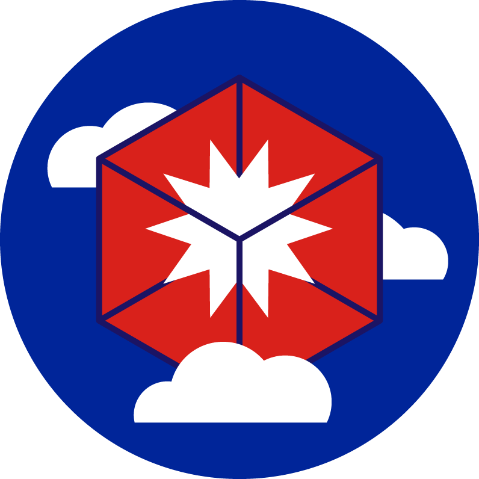

# Stratus Red Team

[](http://golang.org)  [](https://github.com/DataDog/stratus-red-team/actions/workflows/test.yml) [](https://github.com/DataDog/stratus-red-team/actions/workflows/static-analysis.yml)  [](https://api.securityscorecards.dev/projects/github.com/DataDog/stratus-red-team) [](https://bestpractices.coreinfrastructure.org/projects/6530)

<p align="center">
  
</p>

Stratus Red Team is "[Atomic Red Team](https://github.com/redcanaryco/atomic-red-team)™" for the cloud, allowing to emulate offensive attack techniques in a granular and self-contained manner.

<p align="center">
  <a href="https://github.com/DataDog/stratus-red-team/raw/main/docs/demo.gif">
    
  </a>
</p>

Read the announcement blog posts:
- https://www.datadoghq.com/blog/cyber-attack-simulation-with-stratus-red-team/
- https://blog.christophetd.fr/introducing-stratus-red-team-an-adversary-emulation-tool-for-the-cloud/

## Getting Started

Stratus Red Team is a self-contained Go binary.

See the documentation at **[stratus-red-team.cloud](https://stratus-red-team.cloud/)**:
- [Stratus Red Team Concepts](https://stratus-red-team.cloud/user-guide/getting-started/#concepts)

- [Installing Stratus Red Team](https://stratus-red-team.cloud/user-guide/getting-started/#installation) - Homebrew formula, Docker image and pre-built binaries available

- [Available Attack Techniques](https://stratus-red-team.cloud/attack-techniques/list/), mapped to MITRE ATT&CK

## Installation

- Mac OS:

```
brew tap datadog/stratus-red-team https://github.com/DataDog/stratus-red-team
brew install datadog/stratus-red-team/stratus-red-team
```

- Linux / Windows / Mac OS: Download one of the [pre-built binaries](https://github.com/datadog/stratus-red-team/releases).

- Docker:

```bash
IMAGE="ghcr.io/datadog/stratus-red-team"
alias stratus="docker run --rm -v $HOME/.stratus-red-team/:/root/.stratus-red-team/ -e AWS_ACCESS_KEY_ID -e AWS_SECRET_ACCESS_KEY -e AWS_SESSION_TOKEN -e AWS_DEFAULT_REGION $IMAGE"
```

## Using Stratus Red Team as a Go Library

See [Examples](./examples) and [Programmatic Usage](https://stratus-red-team.cloud/user-guide/programmatic-usage/).

## Development

### Building Locally

``` bash
make
./bin/stratus --help
```

### Running Locally

```bash
go run cmd/stratus/*.go list
```

### Running the Tests

```bash
make test
```

### Building the Documentation

For local usage:
```
pip install mkdocs-material mkdocs-awesome-pages-plugin

make docs
mkdocs serve
```

### Acknowledgments

Maintainer: [@christophetd](https://twitter.com/christophetd)

Similar projects (see [how Stratus Red Team compares](https://stratus-red-team.cloud/comparison/)):
- [Atomic Red Team](https://github.com/redcanaryco/atomic-red-team) by Red Canary
- [Leonidas](https://github.com/FSecureLABS/leonidas) by F-Secure
- [pacu](https://github.com/RhinoSecurityLabs/pacu) by Rhino Security Labs
- [Amazon GuardDuty Tester](https://github.com/awslabs/amazon-guardduty-tester)
- [CloudGoat](https://github.com/RhinoSecurityLabs/cloudgoat) by Rhino Security Labs

Inspiration and relevant resources:
- https://expel.io/blog/mind-map-for-aws-investigations/
- https://rhinosecuritylabs.com/aws/aws-privilege-escalation-methods-mitigation/
- https://github.com/elastic/detection-rules/tree/main/rules/integrations/aws
