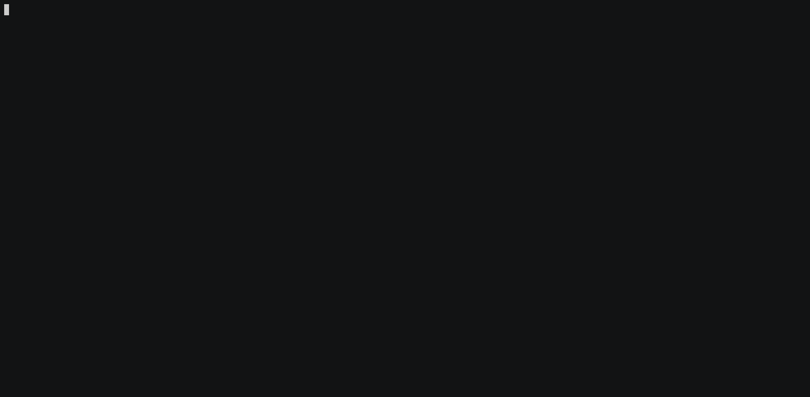

# Home

Welcome to the documentation of Stratus Red Team!

Check out:

- The [User Guide](./user-guide), to get started
- The list of [available attack techniques](./attack-techniques)

<figure markdown>
[](./demo.gif)
<figcaption>Demo of Stratus Red Team. Click to enlage</figcaption>
</figure>

## Motivation Behind Stratus Red Team

When crafting and implementing threat detection rules, it is essential to have an easy way to execute granular attack techniques, to be able to validate that our detections work as expected.

Think of Stratus Red Team as "[Atomic Red Team](https://github.com/redcanaryco/atomic-red-team)™", but focused on cloud.

Stratus Red Team is a self-contained binary. You can use it to easily detonate offensive attack techniques against a live cloud environment.

```bash title="Sample usage - Stopping a CloudTrail Trail (Defense Evasion)"
stratus detonate aws.defense-evasion.stop-cloudtrail
```

The attack techniques are mapped to [MITRE ATT&CK](https://attack.mitre.org/).
