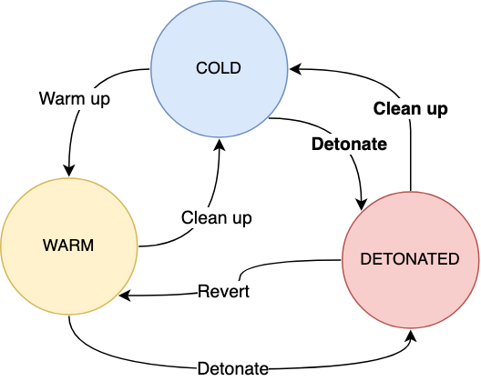

# Getting Started

## Installation

Direct install (required Go 1.19+):

```
go install -v github.com/datadog/stratus-red-team/v2/cmd/stratus@latest
```

- Homebrew:

```bash
brew tap "datadog/stratus-red-team" "https://github.com/DataDog/stratus-red-team"
brew install datadog/stratus-red-team/stratus-red-team
```

- Linux / Windows / macOS: Download a [pre-built binary](https://github.com/datadog/stratus-red-team/releases).

- Docker:

```bash
IMAGE="ghcr.io/datadog/stratus-red-team"
alias stratus="docker run --rm -v $HOME/.stratus-red-team/:/root/.stratus-red-team/ -e AWS_ACCESS_KEY_ID -e AWS_SECRET_ACCESS_KEY -e AWS_SESSION_TOKEN -e AWS_DEFAULT_REGION $IMAGE"
```

## Concepts

An <span class="concept">attack technique</span> is a granular TTP that has *prerequisites* infrastructure or configuration.
You can see the list of attack techniques supported by Stratus Red Team [here](../attack-techniques/list.md).

<span class="concept">Warming up</span> an attack technique means making sure its prerequisites are met, without detonating it. 
Warm-up is a preparation phase, before executing the actual attack. Behind the scenes, Stratus Red Team transparently uses Terraform[^1] to spin up and tear down the prerequisites of each attack technique.

<span class="concept">Detonating</span> an attack technique means executing it against a live environment, for instance against a test AWS account.

<span class="concept">Reverting</span> an attack technique means "cancelling" its detonation, when it had a side effect.

<span class="concept">Cleaning up</span> an attack technique means nuking all its prerequisites and making sure no resource is left in your environment.

An attack technique is <span class="concept">idempotent</span> if it can be detonated multiple times without reverting it.

## Example

Let's take an example with the attack technique [Exfiltrate EBS Snapshot through Snapshot Sharing](../../attack-techniques/AWS/aws.exfiltration.ec2-share-ebs-snapshot/).

- <span class="smallcaps">Warm-up</span>: Create an EBS volume and a snapshot of it
- <span class="smallcaps">Detonation</span>: Share the EBS snapshot with an external AWS account
- <span class="smallcaps">Revert</span>: Unshare the EBS snapshot with the external AWS account
- <span class="smallcaps">Clean-up</span>: Remove the EBS volume and its snapshot

## State Machine

The diagram below illustrates the different states in which an attack technique can be.

<figure markdown>

<figcaption>State Machine of a Stratus Attack Technique</figcaption>
</figure>

## Sample Usage

Stratus Red Team is a self-contained Go binary, embedding all the attack techniques it supports emulating.

You can list available attack techniques using:

```bash
stratus list
```

Detonating a specific attack technique is as simple as running:

```bash
stratus detonate aws.exfiltration.ec2-share-ebs-snapshot
```

You will get an output similar to:

```
2022/01/18 22:32:11 Checking your authentication against the AWS API
2022/01/18 22:32:12 Warming up aws.exfiltration.ec2-share-ebs-snapshot
2022/01/18 22:32:12 Initializing Terraform
2022/01/18 22:32:19 Applying Terraform
2022/01/18 22:32:43 Sharing the volume snapshot with an external AWS account ID...
```

You can then clean up any leftovers from the technique, which in this case will remove the EBS volume and EBS snapshot:

```bash
stratus cleanup aws.exfiltration.ec2-share-ebs-snapshot
```

For more information, see [Usage](./usage.md), [Examples](./examples.md) and the [Command Reference](./commands/list/).

## Connecting to your cloud account

Stratus Red Team currently supports AWS, Azure, Kubernetes, and Amazon EKS.

!!! warning

    Stratus Red Team is supposed to be used against a sandbox cloud account that does not handle production workloads or infrastructure.

### AWS

In order to use Stratus attack techniques against AWS, you need to be authenticated prior to running it, for instance:

- Using [`aws-vault`](https://github.com/99designs/aws-vault)

- Using static credentials in `~/.aws/config`, and setting your desired AWS profile using `export AWS_PROFILE=my-profile`

### EKS

Stratus Red Team does **not** create an EKS cluster for you. It assumes you're already authenticated to an EKS cluster.

To use Stratus attack techniques against Amazon EKS, you need to be authenticated against AWS, as described above. Stratus Red Team will use the current AWS credentials and Kubernetes context to interact with the EKS cluster. It will check that the Kubernetes cluster you're connected to is an EKS cluster, and refuse to run otherwise.

- Authenticate to AWS (for instance, using [`aws-vault`](https://github.com/99designs/aws-vault))
- Run `aws eks update-kubeconfig --name your-cluster-name --region your-region` to update your `~/.kube/config` file with the EKS cluster configuration

### Azure

- Use the [Azure CLI](https://docs.microsoft.com/en-us/cli/azure/install-azure-cli) to authenticate against your Azure tenant:

```
az login
```

- Confirm you have access to at least one Azure subscription:

```json hl_lines="6"
$ az account list
[
  {
    "cloudName": "AzureCloud",
    "homeTenantId": "9bd23af5-8f8b-4410-8418-2bc670d4829a",
    "id": "45e0ad3f-ff94-499a-a2f0-bbb884e9c4a3",
    "isDefault": true,
    "managedByTenants": [],
    "name": "Azure subscription 1",
    "state": "Enabled",
    "tenantId": "9bd23af5-8f8b-4410-8418-2bc670d4829a",
    "user": {
      "name": "you@domain.tld",
      "type": "user"
    }
  }
]
```

- Set the environment variable `AZURE_SUBSCRIPTION_ID`:

```bash
export AZURE_SUBSCRIPTION_ID=45e0ad3f-ff94-499a-a2f0-bbb884e9c4a3
```

!!! Note

    When using Stratus Red Team with Azure, the location in which resources are created cannot be configured and is
    fixed to `West US` (California). See why [here](https://github.com/DataDog/stratus-red-team/discussions/125).


### GCP

- Use the [gcloud CLI](https://cloud.google.com/sdk/gcloud) to authenticate against GCP:

```bash
gcloud auth application-default login
```

- Then, set your project ID:

```bash
export GOOGLE_PROJECT=your-project-id
```

### Kubernetes

Stratus Red Team does not create a Kubernetes cluster for you. 
Instead, it assumes you're already authenticated against a test Kubernetes cluster with kubectl and uses your default context.

As a rule of thumb, Stratus Red Team detonates attack techniques against the cluster you see when running `kubectl cluster-info`.

Tested with Minikube and AWS EKS.


Encountering issues? See our [troubleshooting](./troubleshooting.md) page, or [open an issue](https://github.com/DataDog/stratus-red-team/issues/new/choose).

*[TTP]: Tactics, techniques and procedures

[^1]: While Stratus Red Team uses Terraform under the hood, it doesn't mess with your current Terraform install nor does it require you to install Terraform as a prerequisite. Stratus Red Team will download its own Terraform binary in `$HOME/.stratus-red-team`.
